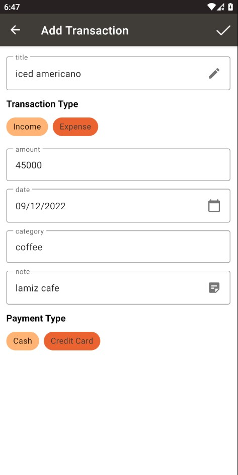

# ArFincance

## Introduction
This is a finance managment application based on the MVVM architectural pattern.
This project is my final Intership courses project.

## Technologies & Architecture 

#### Technologies
* Android, Kotlin 
* [Room](https://developer.android.com/jetpack/androidx/releases/room/) - Local DataBase
* [Dagger Hilt](https://github.com/google/dagger) - dependency injection
* [Groupie](https://github.com/lisawray/groupie) - recyclerviews
* [lottie](https://github.com/airbnb/lottie-android) - animations

#### Architecture
Model-View-ViewModel

* [ViewModel](https://developer.android.com/topic/libraries/architecture/viewmodel)
* [LiveData](https://developer.android.com/topic/libraries/architecture/livedata)
* [DataBinding](https://developer.android.com/topic/libraries/data-binding)
* [Navigation Component](https://developer.android.com/guide/navigation)
* [Kotlin Android Coroutines](https://developer.android.com/kotlin/coroutines)

## Screenshots

### MainPage

  
  

### Transactions

  
  

### category

  

